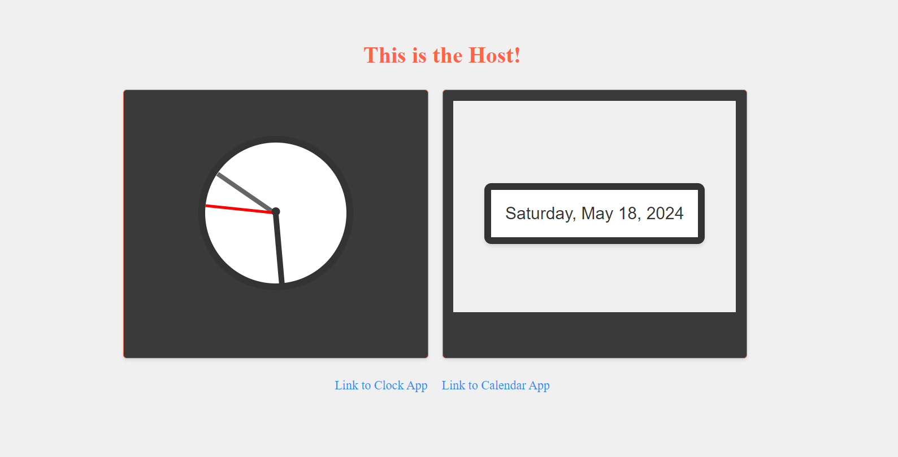

# Microfrontend Application

This project demonstrates a microfrontend architecture where multiple independent frontend applications are integrated into a single host application.

## Overview

The microfrontend architecture divides a large frontend application into smaller, more manageable parts called microfrontends. Each microfrontend is developed, tested, deployed, and maintained independently. These microfrontends are then integrated into a host application to provide a cohesive user experience.

In this project, we have the following microfrontends:

- **Host Application (`host-app`)**: The host application serves as the shell for integrating and orchestrating multiple microfrontends. It provides the infrastructure for loading, communicating between, and managing the lifecycle of microfrontends.

- **Clock Application (`clock-app`)**: A microfrontend responsible for displaying a clock widget. It can be developed, tested, and deployed independently of other microfrontends.

- **Calendar Application (`calendar-app`)**: Another microfrontend responsible for displaying a calendar widget. Like the clock application, it operates independently and can be developed, tested, and deployed separately.



## Getting Started

To run the microfrontend application locally, follow these steps:

Note: Currently to run the app, Please run all the apps individually in different terminals

1. Install dependencies for the host application:

   ```bash
   cd host-app
   npm install
   ```

2. Install dependencies for the clock application:

   ```bash
   cd ../clock-app
   npm install
   ```

3. Install dependencies for the calendar application:

   ```bash
   cd ../calendar-app
   npm install
   ```

4. Start the application:

   ```bash
   cd ..
   npm start
   ```

5. Access the host application in your browser at `http://localhost:3000`.

## Architecture

The microfrontend architecture consists of the following components:

- **Host Application**: The main entry point of the microfrontend architecture. It dynamically loads and orchestrates microfrontends.

- **Microfrontends**: Independent frontend applications developed, tested, and deployed separately. Each microfrontend encapsulates its functionality and can be integrated into the host application seamlessly.

- **Communication Mechanisms**: Microfrontends communicate with the host application and each other using established patterns such as events, messages, or APIs.

- **Routing and Navigation**: The host application manages routing and navigation between microfrontends, ensuring a consistent user experience.

## Contributing

Contributions are welcome! If you'd like to contribute to this project, please follow these steps:

1. Fork the repository and create your branch:

   ```bash
   git checkout -b feature/my-feature
   ```

2. Commit your changes and push to your branch:

   ```bash
   git commit -am 'Add my feature'
   git push origin feature/my-feature
   ```

3. Submit a pull request detailing your changes.

## License

This project is licensed under the MIT License - see the [LICENSE](LICENSE) file for details.
